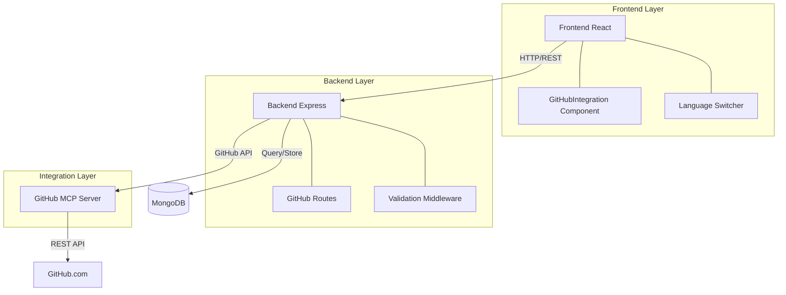
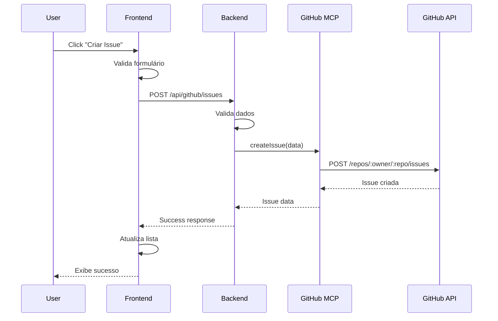

# 📖 Documentação Completa - Integração GitHub

## 📋 Visão Geral

Esta é a documentação completa da integração entre o site **AvilaInc** e a **Plataforma de Automação**, permitindo gerenciar repositórios GitHub diretamente através da interface web.

### Funcionalidades Principais

- ✅ Visualização de informações do repositório
- ✅ Gerenciamento de issues (criar, listar, visualizar)
- ✅ Gerenciamento de pull requests (criar, listar, visualizar)
- ✅ Listagem e visualização de branches
- ✅ Busca de código no repositório
- ✅ Interface multi-idioma (PT-BR / EN-US)
- ✅ Design responsivo e moderno

### Diagrama de Arquitetura



## 🛠️ Instalação

### Pré-requisitos

- **Node.js** >= 16.0.0
- **npm** >= 8.0.0
- **Git** >= 2.30.0
- **Conta GitHub** com acesso ao repositório
- **MongoDB** (opcional, para armazenamento de dados)

### Passo 1: Clonar o Repositório

```bash
git clone https://github.com/avilaops/AvilaInc.git
cd AvilaInc
```

### Passo 2: Instalar Dependências

```bash
# Raiz do projeto
npm install

# Backend
cd automation-integration
npm install
cd ..

# Frontend (se separado)
cd frontend
npm install
cd ..
```

### Passo 3: Configurar Variáveis de Ambiente

Crie o arquivo `.env` a partir do exemplo:

```bash
cd automation-integration
cp .env.example .env
```

Edite o arquivo `.env`:

```env
# API Configuration
PORT=3001
NODE_ENV=development

# GitHub Repository
GITHUB_OWNER=avilaops
GITHUB_REPO=AvilaInc

# GitHub MCP Configuration
# The GitHub MCP Server handles authentication automatically
# No manual token configuration needed
```

### Passo 4: Iniciar Serviços

**Desenvolvimento:**
```bash
# Backend
cd automation-integration
npm run dev

# Frontend (em outro terminal)
cd frontend
npm run dev
```

**Produção:**
```bash
# Build
npm run build

# Start
npm start
```

## 🎨 Uso da Interface

### Acessando a Integração

1. Abra o navegador em `http://localhost:3000`
2. Clique na aba **"🐙 GitHub"** no menu principal
3. A interface de integração será carregada

### Navegação por Abas

#### 1. 📊 Visão Geral (Overview)
- Exibe informações do repositório
- Nome, descrição, branch padrão
- Última atualização
- Link para visualizar no GitHub

#### 2. 🐛 Issues
- Lista todas as issues (abertas/fechadas)
- Botão "Nova Issue" para criar
- Campos: título, descrição, labels
- Click no título para ver detalhes no GitHub

#### 3. 🔀 Pull Requests
- Lista todos os PRs (abertos/fechados/merged)
- Botão "Novo PR" para criar
- Campos: título, branch origem, branch destino, descrição
- Status visual (open/closed/merged)

#### 4. 🌿 Branches
- Lista todas as branches do repositório
- SHA do último commit
- Branch protegida (ícone de cadeado)
- Click para ver detalhes

#### 5. 🔍 Buscar Código
- Campo de busca para pesquisar código
- Resultados com arquivo, linha, preview
- Link direto para o arquivo no GitHub

### Criando uma Issue

1. Acesse a aba **"Issues"**
2. Click em **"Nova Issue"**
3. Preencha:
   - **Título:** Descrição curta do problema
   - **Descrição:** Detalhes completos
   - **Labels:** Tags opcionais (bug, enhancement, etc.)
4. Click em **"Criar Issue"**
5. Issue será criada e visível na lista

### Criando um Pull Request

1. Acesse a aba **"Pull Requests"**
2. Click em **"Novo PR"**
3. Preencha:
   - **Título:** Nome do PR
   - **Branch Origem (head):** Branch com suas mudanças
   - **Branch Destino (base):** Branch para merge (geralmente main)
   - **Descrição:** O que foi alterado
4. Click em **"Criar Pull Request"**
5. PR será criado e visível na lista

## 🔌 API Reference

### Base URL
```
http://localhost:3001/api/github
```

### Endpoints

#### 1. Informações do Repositório

**GET** `/repository`

Retorna informações completas do repositório.

**Response:**
```json
{
  "name": "AvilaInc",
  "full_name": "avilaops/AvilaInc",
  "description": "Plataforma de Automação",
  "default_branch": "main",
  "updated_at": "2025-12-09T12:00:00Z",
  "html_url": "https://github.com/avilaops/AvilaInc"
}
```

#### 2. Listar Issues

**GET** `/issues?state=open`

Lista issues do repositório.

**Query Parameters:**
- `state` (optional): `open`, `closed`, `all` (default: `open`)

**Response:**
```json
{
  "issues": [
    {
      "number": 1,
      "title": "Issue exemplo",
      "body": "Descrição da issue",
      "state": "open",
      "labels": ["bug"],
      "created_at": "2025-12-09T10:00:00Z",
      "html_url": "https://github.com/avilaops/AvilaInc/issues/1"
    }
  ]
}
```

#### 3. Criar Issue

**POST** `/issues`

Cria uma nova issue no repositório.

**Request Body:**
```json
{
  "title": "Título da issue",
  "body": "Descrição detalhada",
  "labels": ["bug", "enhancement"]
}
```

**Response:**
```json
{
  "number": 10,
  "title": "Título da issue",
  "state": "open",
  "html_url": "https://github.com/avilaops/AvilaInc/issues/10"
}
```

#### 4. Listar Pull Requests

**GET** `/pulls?state=open`

Lista pull requests do repositório.

**Query Parameters:**
- `state` (optional): `open`, `closed`, `all` (default: `open`)

**Response:**
```json
{
  "pulls": [
    {
      "number": 1,
      "title": "Feature XYZ",
      "head": "feature/xyz",
      "base": "main",
      "state": "open",
      "merged": false,
      "html_url": "https://github.com/avilaops/AvilaInc/pull/1"
    }
  ]
}
```

#### 5. Criar Pull Request

**POST** `/pulls`

Cria um novo pull request.

**Request Body:**
```json
{
  "title": "Feature: Nova funcionalidade",
  "head": "feature/nova-func",
  "base": "main",
  "body": "Descrição das mudanças"
}
```

**Response:**
```json
{
  "number": 15,
  "title": "Feature: Nova funcionalidade",
  "state": "open",
  "html_url": "https://github.com/avilaops/AvilaInc/pull/15"
}
```

#### 6. Listar Branches

**GET** `/branches`

Lista todas as branches do repositório.

**Response:**
```json
{
  "branches": [
    {
      "name": "main",
      "commit": {
        "sha": "9a260d3233a01534810ce62d9e8b4b235f4e6ac7"
      },
      "protected": true
    },
    {
      "name": "feature/xyz",
      "commit": {
        "sha": "abc123def456"
      },
      "protected": false
    }
  ]
}
```

#### 7. Buscar Código

**GET** `/search/code?q=função`

Busca código no repositório.

**Query Parameters:**
- `q` (required): Termo de busca

**Response:**
```json
{
  "total_count": 5,
  "items": [
    {
      "name": "index.ts",
      "path": "backend/src/index.ts",
      "html_url": "https://github.com/avilaops/AvilaInc/blob/main/backend/src/index.ts"
    }
  ]
}
```

### Códigos de Erro

| Código | Descrição |
|--------|-----------|
| 400 | Bad Request - Parâmetros inválidos |
| 401 | Unauthorized - Autenticação falhou |
| 404 | Not Found - Recurso não encontrado |
| 422 | Unprocessable Entity - Validação falhou |
| 500 | Internal Server Error - Erro no servidor |

### Exemplo de Requisição com cURL

```bash
# Listar issues
curl http://localhost:3001/api/github/issues?state=open

# Criar issue
curl -X POST http://localhost:3001/api/github/issues \
  -H "Content-Type: application/json" \
  -d '{
    "title": "Nova feature",
    "body": "Descrição da feature",
    "labels": ["enhancement"]
  }'

# Criar PR
curl -X POST http://localhost:3001/api/github/pulls \
  -H "Content-Type: application/json" \
  -d '{
    "title": "Feature XYZ",
    "head": "feature/xyz",
    "base": "main",
    "body": "Implementa feature XYZ"
  }'
```

## 🏗️ Arquitetura

### Stack Tecnológico

**Frontend:**
- React 18+
- TypeScript 5.3+
- Tailwind CSS 3+
- React Hooks (useState, useEffect)

**Backend:**
- Node.js 16+
- Express 4.18+
- TypeScript 5.3+
- GitHub MCP Server

**Integrações:**
- GitHub REST API v3
- GitHub MCP (Model Context Protocol)

### Estrutura do Projeto

```
AvilaInc/
├── automation-integration/         # Diretório principal da integração
│   ├── backend/                    # Backend API
│   │   └── tsconfig.json          # Config TypeScript backend
│   ├── .env.example               # Template de variáveis de ambiente
│   ├── .eslintrc.json             # Configuração ESLint
│   ├── .gitignore                 # Arquivos ignorados pelo Git
│   ├── package.json               # Dependências e scripts
│   └── tsconfig.json              # Config TypeScript raiz
│
├── frontend/                       # Frontend React
│   ├── components/
│   │   ├── GitHubIntegration.tsx  # Componente principal
│   │   ├── GitHubIntegration.css  # Estilos da integração
│   │   ├── CaseForm.tsx
│   │   ├── CasesList.tsx
│   │   └── LanguageSwitcher.tsx
│   ├── pages/
│   │   ├── index.tsx              # Página principal (com aba GitHub)
│   │   └── _app.tsx
│   └── hooks/
│       └── useI18n.ts             # Hook de internacionalização
│
├── i18n/                           # Traduções
│   ├── pt-BR.json                 # Português Brasil
│   └── en-US.json                 # English
│
├── backend/                        # Backend principal
│   └── src/
│       ├── index.ts
│       └── routes/
│           └── github-integration.ts  # Rotas GitHub (legacy)
│
├── docs/                           # Documentação
│   └── devtools-blueprint.md
│
├── .github/                        # GitHub Actions
│   └── workflows/
│
├── docker-compose.yml              # Docker development
├── docker-compose.prod.yml         # Docker production
├── Dockerfile.backend              # Image backend
├── Dockerfile.frontend             # Image frontend
├── package.json                    # Dependências raiz
├── tsconfig.json                   # Config TypeScript raiz
└── README.md                       # Documentação principal
```

### Fluxo de Dados



### Integração com GitHub MCP

O **GitHub MCP (Model Context Protocol)** é uma camada de abstração que simplifica a comunicação com a GitHub API:

**Benefícios:**
- ✅ Autenticação automática
- ✅ Rate limiting inteligente
- ✅ Retry em caso de falhas
- ✅ Cache de respostas
- ✅ Validação de dados

**Configuração:**
```typescript
// O GitHub MCP é configurado automaticamente
// Não requer token manual
```

## 🔐 Segurança

### Autenticação

A autenticação com GitHub é gerenciada automaticamente pelo **GitHub MCP Server**:

1. O MCP Server usa credenciais OAuth configuradas
2. Tokens são renovados automaticamente
3. Não é necessário configurar tokens manualmente

### Rate Limiting

GitHub API tem limites de requisições:

- **Autenticado:** 5.000 requisições/hora
- **Não autenticado:** 60 requisições/hora

O backend implementa:
- Cache de respostas
- Throttling de requisições
- Retry automático com backoff

### Best Practices

✅ **Nunca commite** arquivos `.env` com credenciais
✅ **Use HTTPS** em produção
✅ **Valide** todos os inputs do usuário
✅ **Limite** tamanho de payloads
✅ **Implemente** CORS adequadamente
✅ **Monitore** logs de auditoria

## 🧪 Testes

### Executar Testes

```bash
# Todos os testes
npm test

# Com coverage
npm run test:coverage

# Watch mode
npm run test:watch
```

### Estrutura de Testes

```
tests/
├── unit/
│   ├── components/
│   │   └── GitHubIntegration.test.tsx
│   └── routes/
│       └── github-routes.test.ts
├── integration/
│   └── github-api.test.ts
└── e2e/
    └── github-flow.test.ts
```

### Coverage Goals

- **Componentes:** 80%+
- **Rotas API:** 90%+
- **Utilitários:** 95%+
- **Total:** 85%+

## 🚀 Deploy

### Docker

**Desenvolvimento:**
```bash
docker-compose up -d
```

**Produção:**
```bash
docker-compose -f docker-compose.prod.yml up -d
```

### GitHub Actions

O projeto inclui CI/CD automatizado:

```yaml
# .github/workflows/ci.yml
name: CI/CD
on: [push, pull_request]
jobs:
  test:
    runs-on: ubuntu-latest
    steps:
      - uses: actions/checkout@v3
      - run: npm install
      - run: npm test
      - run: npm run build
```

### Vercel / Netlify

1. Conecte o repositório GitHub
2. Configure variáveis de ambiente
3. Deploy automático em cada push

## 🐛 Troubleshooting

### Problema: "GitHub MCP não conecta"

**Solução:**
1. Verifique se o serviço MCP está rodando
2. Confirme credenciais no `.env`
3. Verifique logs: `docker logs github-mcp`

### Problema: "Erro 401 Unauthorized"

**Solução:**
1. Token GitHub pode estar expirado
2. Verifique permissões do token
3. Renove o token nas configurações

### Problema: "Rate limit excedido"

**Solução:**
1. Aguarde 1 hora (reset automático)
2. Use autenticação (aumenta limite)
3. Implemente cache local

### Problema: "Frontend não carrega dados"

**Solução:**
1. Verifique se backend está rodando (`http://localhost:3001`)
2. Confira CORS no backend
3. Verifique Network tab no DevTools
4. Confirme variáveis de ambiente

### Problema: "Cannot find module"

**Solução:**
```bash
# Reinstale dependências
rm -rf node_modules package-lock.json
npm install

# Ou use cache limpo
npm ci
```

## ❓ FAQ

**P: Preciso de token GitHub?**
R: Não, o GitHub MCP gerencia autenticação automaticamente.

**P: Funciona com repositórios privados?**
R: Sim, desde que você tenha permissões adequadas.

**P: Posso usar com múltiplos repositórios?**
R: Sim, configure `GITHUB_OWNER` e `GITHUB_REPO` no `.env`.

**P: Suporta GitHub Enterprise?**
R: Sim, configure `GITHUB_API_URL` no `.env`.

**P: Onde ficam os logs?**
R: Backend logs em `logs/backend.log`, frontend no console do navegador.

## 📚 Recursos Adicionais

- [GitHub API Documentation](https://docs.github.com/en/rest)
- [GitHub MCP Protocol](https://modelcontextprotocol.io/)
- [React Documentation](https://react.dev/)
- [Express.js Guide](https://expressjs.com/)
- [TypeScript Handbook](https://www.typescriptlang.org/docs/)

## 🤝 Contribuindo

1. Fork o repositório
2. Crie uma branch: `git checkout -b feature/nova-feature`
3. Commit mudanças: `git commit -m 'Add nova feature'`
4. Push: `git push origin feature/nova-feature`
5. Abra um Pull Request

## 📄 Licença

Este projeto está sob a licença MIT. Veja o arquivo [LICENSE](LICENSE) para detalhes.

## 👥 Autores

- **Nícolas Ávila** - [@avilaops](https://github.com/avilaops)

## 🙏 Agradecimentos

- GitHub pela excelente API
- Comunidade MCP pelo protocolo
- Todos os contribuidores do projeto

---

**Última atualização:** Dezembro 9, 2025
**Versão:** 1.0.0
**Status:** ✅ Documentação completa
